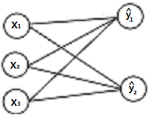

# 내적의 활용 3 : **유사도**

**similarity**

- 두 벡터의 유사성을 정량적으로 나타낸 값.

내적값이 크면 클수록 서로 비슷한 벡터임을 알 수 있다.

X₁, X₂이 서로 유사하고, X₃,x₄가 서로 유사하다고 했을때, X₁.T @ X₂의 값이 X₁.T @ X₃이나 x₄보다 크다.

<br>
<br>

# 내적의 활용 4 : **선형회귀 모형**

**·** 독립 변수(서로 관계가 없는 변수)x 에 의해서 값이 변하는 y를 예측하는 방법

```py
^y(와이 햇) #y를 예측하기 위한 모델
```

가중치 : ^y를 결정하기 위한 x의 중요도를 측정한 값. (`w`)

y : 실제 변수

```
w=[0,1,2,3]
x=[0,1,2,3]
w@x = ^y
```


> □을 뉴런, →를 곱하기, ^y에 → → →가 모여있으므로 더하기

<br>
<br>

# 행렬과 행렬의 곱셈

두 행렬의 곱셈은 내적과 동일한 규칙을 가진다.

### 1. 곱하는 앞 행렬의 열의 개수와, 뒷 행렬의 행의 개수가 일치.

## 2. (M X N) @ (N X K)의 곱의 결과는 M X K 행렬이 만들어지며, 각 원소의 값은 *각 행벡터와 열벡터를 차례대로 내적한 스칼라 값*이다.

```
M₁.T @ K₁   M₁.T @ K₂,  M₁.T @ K₃
M₂.T @ K₁   M₂.T @ K₂,  M₂.T @ K₃
```

## 선형회귀로 보는 행렬의 곱셈



```perl

                [x₁
[w₁₁,w₁₂,w₁₃  @  x₂       = [^y₁
 w₂₁,w₂₂,w₂₃]    x₃]         ^y₂]

#벡터 w₁@벡터 x₁ = ^y₁
#벡터 w₂@벡터 x₂ = ^y₂
        ▽
# 행렬w @ # 행렬 x = 행렬 ^y
```

<br>
<br>

# **교환법칙과 분배 법칙**

#### **벡터와 스칼라와는 달리,**

### ⭐ **행렬의 *곱셈*은 교홥법칙이 성립하지 않는다.** ⭐

AB ≠ *(항상)*BA
<br><br>

### **행렬의 *덧셈*은 분배법칙이 성립한다.**

A(B+C) = AB + AC

(A+B)C = AC + BC
<br><br>

## **전치연산의 분배법칙**

### ***덧셈*의 전치연산또한 분배법칙이 성립한다.**

(A+B)T=AT+BT
<br><br>
_곱셈은 분배되면서 곱셈의 순서가 바뀐다._

1. (A·B)T=BT·AT
2. (A·B·C)T=CT·BT·AT
   <br>
   <br>

# **곱셈의 연결**

행렬의 곱셈이 연결되어 있을 때, 순서는 **상관이 없다.**

A @ B @ C @D

(AB)CD = A(BC)D = AB(CD)

> 순서만 바꾸라는거지, DxC ≠ CxD이기 때문에 순서를 주의해야 한다.

<br>
<br>

# 항등행렬의 곱셈

항등행렬 = I

1. 어떤 행렬이든 항등행렬을 곱하면 행렬의 값이 변하지 않는다.
2. 항등행렬과의 곱은 교환법칙이 성립한다.

<br>
<br>

# 행렬과 벡터의 곱셈

> "NxM인 행렬과 M차원 벡터끼리는 곱이 가능하다."

## **행렬과 벡터의 곱은 _벡터_**

> M차원 벡터 = M X 1
> (N X M) @ (M X 1) = N X 1

<br>
<br>

## 행렬과 벡터의 내적은 선형조합으로 표현할 수 있다.

```perl
2 x 3 행렬 M과 벡터 V의 내적

[w₁₁ | w₁₂ | w₁₃    [V₁
 w₂₁ | w₂₂ | w₂₃]    V₂
                     V₃]

에서 각 w₁₁, w₂₁ 와 같이 같은 열에 놓인 값을 Cn으로 묶어보면
M = [ c₁    C₂    C₃ ] 로 마치 행벡터로 표현할 수 있고,

V =
[ V₁
  V₂
  V₃] 으로 각각 스칼라 값이다.

따라서 둘의 내적은 c₁V₁ + C₂V₂ + C₃V₃ 이며,

 c₁,C₂,C₃는 각각 "열벡터" 이므로 "벡터와 스칼라의 곱의 덧셈" 인 "선형조합" 이다.

[1 2 3]   [2]          [1X2 + 2X3 + 3X4]   [20]
[4 5 6] & [3]  의 곱을  [4X2 + 5X3 + 6X4]   [47]로도 표현할 수 있지만
          [4]

                     [1]     [2]     [3] [20]
        선형조합  2 X    + 3 X   + 4 X   =     로도 표현이 가능하다.
                     [4]     [5]     [6] [47]
```

## 정리

**행렬과 벡터(w1,w2,..)의 곱**의 두 가지 관점

1. 열벡터와 w1,w2,..의 선형조합
2. 행벡터와 w1,w2,..의 내적

# 잔차

error

residual

### 측정치 벡터 X와 선형회귀를 통해 예측한 가중치벡터 w의 내적으로 구한 ^y와 실제값 y의 오차.

공식:

> # e = y - ^y
>
> ## = y -

<br>
<br>

# 잔차 제곱합 RSS

> 잔차벡터가 작으면 좋은 모델이라는 것을 알 수 있다.
>
> 잔차의 대소를 판단하기 위해, 잔차를 합해서 큰지 작은지를 판단하는데, 잔차에는 "음수도 있고 양수도 있어서" 바로 합하는 것은 의미가 없다.
>
> 따라서 "잔차를 제곱해주고 합"한다.

잔차벡터를 e라고했을때

**잔차 제곱합**은 다음과 같다.

```py
∑(i=1~N) e²i
#같은 벡터의 곱
= e.T @ e
= (y−Xw).T @ (y−Xw)
#전개
= yT·Y -yT·Xw - wT·X·Ty + "WT·XT·X·w"
```

<br>
<br>

# **이차형식**

잔차 제곱합 전개식에서 `WT·XT·X·w`를 이차형식이라고 부른다.

이것을 전개하면

```
= ∑(i=1~N) ∑(j=1~N) a(i,j)·Xi·Xj
```

이 된다.

<br>

# 부분행렬

## 두 정방행렬의 곱을 계산하는 방법

```py

#부분행렬
a = [1 2   b = [5 6
     3 4]       7 8]
a @ b=
[[19, 22]
 [43, 50]]

# 1. a를 행벡터로 쪼개기
a[0] @ b = [19, 22]
a[1] @ b = [43, 50]

# 2. b를 열벡터로 쪼개기
a @ b.T[0] = [19]  a @ b.T[1] = [22]
             [43]               [50]

3. a를 열벡터로, b를 행벡터로 쪼개기
np.array(([1],[3])) @np.array([[5,6]])

= [ 5,  6]    [14, 16]   [19 22]
            +          =
  [15, 18]    [28, 32]   [43 50]
```
