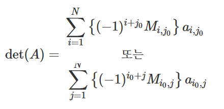

# 정부호

행렬, 벡터에 실수처럼 부호나 크기를 정의하기는 어렵지만, _이차형식_ 을 이용해서 항상 0보다 "크다 or 크거나 같다"를 정의할수 있다.

1. 정부호 positive definite

   모든 벡터 x`(x≠0)`에 대해

   XT·A·X ＞ 0

   를 만족하는 A를 **_"양의 정부호"_** 라고 한다.

```PY
# 1. 양의 정부호 예시 : 항등행렬
x.T @ I @ X
= x.T @ X
= X²
# ∴ X ≠ 0 이므로 X²은 항상 0보다 크다.
"I는 양의 정부호이다."
```

2. 준정부호 positive _Semi_-definite

   모든 벡터 x`(x≠0)`에 대해

   XT·A·X ≥ 0

   를 만족하는 A를 **_"양의 준정부호"_** 라고 한다.

```
(x₁+x₂)²,(x₁+x₂)²
```

0보다 큰 값을 만족하거나 0이 되는 값이 "존재하는지" 찾아보는 추가적인 계산이 필요함.
<BR><BR>

# 행렬의 크기 1. 놈

∥A∥ p = ( ∑ ∑|aij|^p)^1/p (i, j = 1~N)

> 행렬/벡터의 모든 원소에 `|절댓값|`을 취하고, `p` 제곱한 것을 다 더해 `p제곱근`을 취한 값.

p는 보통 `1, 2 또는 무한대(∞)가 사용`되는데

이 중 p=2인 경우가 가장 많이 쓰이므로 p값 표시가 없는 경우는 p=2인 *놈*이라고 생각하면 된다. (L2 Norm)

∥A∥=∥A∥₂ = ∥A∥F = √(∑∑ a²ij)(i, j = 1~N)

> 절대값 부호는 제곱하는 경우 무의미해 포함하지 않음.

이 *놈*을 **프로베니우스 놈(Frobenius norm)** 이라고 한다.

## 벡터의 **_"놈"_**

벡터 x의 놈 `∥*x*∥` 은 벡터의 모든 원소를 제곱한 것의 합의 제곱근이다.

따라서 `∥*x*∥² 는 " 벡터의 모든 원소를 제곱한 것의 합", 제곱합`이다.

> 벡터의 놈의 제곱은 제곱합이다.

<br>
<br>

## "놈"의 정확한 정의

1. 놈의 값은 0이상이다. 영행렬일 때만 놈의 값이 0이 된다.

   - ∥A∥≥ 0

2. 행렬에 스칼라를 곱하면 놈의 값도 그 스칼라의 절대값을 곱한 것과 같다.

   - ∥αA∥=|α|∥A∥

3. 행렬의 합의 놈은 각 행렬의 놈의 합보다 작거나 같다.

   - ∥A+B∥≤∥A∥+∥B∥

4. 정방행렬의 곱의 놈은 각 정방행렬의 놈의 곱보다 작거나 같다.

   - ∥AB∥≤∥A∥∥B∥

## 위의 네가지 **_성질_**을 만족하는 행렬

<BR>
<BR>

# 대각합

### tr(A)

`정방행렬`에서 대각원소의 합

tr(A)=a₁₁+a₂₂+⋯+ann=∑aii (i=1~n)

1. tr()를 사용하려면 "정방행렬" 이어야 한다.

- 즉, 각각의 안쪽의 행렬이 반드시 정방행렬일 필요는 없으나 **곱셈의 결과가 정방행렬이어야 한다.**

2. 스칼라를 곱하면 대각합은 스칼라와 원래의 대각합의 곱이다.

   - tr(cA)=c·tr(A)

3. 전치연산을 해도 대각합이 달라지지 않는다.

   - tr(A.T)=tr(A)
   - 전치연산은 대각합을 기준으로 위치를 바꾸는 것이기 때문에, 대각원소는 변화하지 않기 때문.

<br>

3. 두 행렬의 합의 대각합은 두 행렬의 대각합의 합이다.
   - 행렬의 합은 같은 위치의 원소끼리의 합이므로 당연.
   - tr(A+B)=tr(A)+tr(B)

### ⭐ **중요한 성질** ⭐

4. 두 행렬의 곱의 대각합은 행렬의 순서를 바꾸어도 달라지지 않는다.

   - tr(A·B)=tr(B·A)

5. 세 행렬의 곱의 대각합은 다음과 같이 순서를 순환시켜도 달라지지 않는다.

   - tr(A·B·C)=tr(B·C·A)=tr(C·A·B)
   - **트레이스 트릭(trace trick)** 이라고 한다.

> xT·A·X를 _"이차형식"_ 이라고 배웠는데, 이 값은 결과적으로 `스칼라` 값이다.
>
> 따라서 trace(이차형식) = 이차형식값과 차이가 없다. (1x1 행렬의 대각원소는 결국 자기 자신이므로)
>
> 그런데 5번 성질에서 tr(xT·A·X) = tr(x·xT·A)와 차이가 없다.
> 따라서 `xT·A·X = tr(x·xT·A)`인데, 이 성질은 이차형식의 미분에서 사용된다.

# ⭐ **행렬식** ⭐

## **|A|**

정방행렬 A가 스칼라, 즉 1x1인경우
det(a) = a이다.


