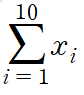

## **수열**

숫자를 **순서대로 나열**

= 순서가 있으면 **수열**

표현

[`x₁`,`x₂`,`x₃`,`x₄`]

`x₁:N : x₁부터 Xn까지의 수열`

- 중복이 가능하다.

---

### **순서가 없으면**

## **집합**

표현 <br>
{`x₁`,`x₂`,`x₃`,`x₄`}
<br> `{x₁:N} : 1부터 Xn까지의 집합`

- 중복이 불가능 하다.

---

## **· 포함** <br>

**x ∈ A**

### **· 실수전체의 집합** **R**

> 또는 **|R** 로도 표현

? 개로 이루어진 숫자쌍은 `(x1, x2 .. x?)` 괄호로 표현할 수 있다.

```py
"2개의 순서쌍이 실수이다." 의 표현
= 2개의 순서쌍이 모두 실수집합에 포함된다.
(x₁ x₂) ∈ R x R
(x₁ x₂) ∈ R²

# Q. X ∈ Rⁿ이 의미하는것은 ?
A. X는 n개의 숫자를 가진 벡터이다.
```

---

## **· 합과 곱의 표현**

### **∑ (Sum) 합**

### **Π (Product) 곱**

복습 : X₁~X10까지의 합



# **선형대수**

## **여러 개의 데이터에 대한 계산을 돕는 학문**

## **· 스칼라** <br>

하나의 값. <br>
**[In Data]** - 조사한 결과 하나

## · **벡터** <br>

여러 개의 스칼라 값. <br>

**[In Data]**
<br> **·** `여러` 개체에 대한 `한` 가지 항목의 값 열거할 땐 **열벡터**

| 무게(kg) |
| :------: |
|    73    |
|    70    |
|    64    |

> 벡터의 형태는 `기본적으로 열벡터`이다.

<br> **·** `한` 개체에 대한 `여러` 가지 항목의 값 열거할 땐 **행벡터**

|  이름  | 키  | 나이 | 몸무게 |
| :----: | :-: | :--: | :----: |
| 김상휘 | 173 |  28  |   75   |

> **데이터의 성질에 따라 행백터로 `변환을 하여 사용`**

머신러닝 모델이 데이터의 특징을 이해하기 위해 사용하는 방법 특징벡터

비슷한 데이터는 비슷한 데이터의 모양을 갖는다.
<br><br>

# **행렬**

여러 벡터의 모임

**[In Data]**

: 데이터의 표본수(행)과 항목의 개수(열)을 나타낸 것

`N행 M열` = N개의 개체에 대한 M개의 항목

표기 : 대문자 `X`

원소의 표기 _x_
1행1열의 원소 *x*₁₁
1행1열의 원소 *x*₄₃

---

1. 열 벡터 `길이가 길어진다` : 조사할 표본(개체)가 늘어난다.

| 무게(kg) |
| :------: |
|    73    |
|    70    |
|    64    |
|   ...    |
|    53    |
|    67    |

2. 행 벡터 `길이가 길어진다` : 조사할 항목이 증가한다.

| 이름 | 키  | 나이 | 몸무게 | ..  | 수학성적 | 영어성적 |
| :--: | :-: | :--: | :----: | :-: | :------: | :------: |

<br>
> 길이가 질어지는 것과, 개수가 늘어나는 것이 다른 개념임을 기억해야 한다.

```py
[28세,73kg]
[25세,50kg]
= 표본이 추가 됨
= 행의 "개수 증가", 열의 "길이 증가"

[28세, 73kg, A형]
= 항목이 추가됨
= 열의 "개수 증가", 행의 "길이 증가"
```

_Tip_

**머신러닝 모델은 1차원을 인식하지 못함**

> 1차원 배열의 표기 = np array([[1,2,3])

<br><br>

# **Axis**

## **축**

**데이터의 진행방향(데이터가 추가되는 방향)**

`numpy`의 Axis의 인덱스

```py
스칼라 : axis가 없음.

벡터 : [1,2,3]
벡터의 값이 추가 되는 방향은 [1,2,3,"4" ]
뿐이므로, axis는 하나이고, 이 방향은 axis=0이다.

행렬 :
[1,2,3]
[5,6,7]
의 2차원 ary에서

데이터가 추가될 수 있는 방향은
[1,2,3,"4"]
[5,6,7,"8"] # 1차원에서 0차원 추가되는 경우 (axix=1)

 [1,2,3]
 [5,6,7]
"[9,10,11]" # 2차원에서 1차원이 추가되는 경우 (axis=0)
두 가지 방향을 가지며
"선택이 가장 가까운" 2차원->1차원의 방향이 axis[0]이 된다.
(3차원은 3->2차원의 방향이 axis=0)
```

<BR>

# **텐서**

In Data <br>
**다차원 배열**
|데이터|수학
|:-:|:-:
|0 Rank `Tensor`|스칼라
|1 Rank `Tensor`|벡터
|2 Rank `Tensor`|매트릭스
|3 Rank `Tensor`|`텐서`
<BR>

# **전치연산 Transpose**

행열에서 행과 열의 인덱스를 서로 바꾸는 연산.

X **.T**

N x M 행렬인 (M₁)의 전치행렬 M₂는 M x N 행렬이다.

```PY
벡터는 기본적으로 "열벡터"라고 표기한다.
벡터 R의 전치행렬 R.T는 "행벡터"를 의미한다.
```

<BR>

# **행렬의 행 표기법과 열 표기법**

m x n인 행렬 S는 n차원 벡터가 m개 있는 행렬이다.

S = [C₁ C₂ C .. Cm] <br>
```
<열백터 C> 
[1, 
 2, 
 3] 
```
<BR>

# **다양한 종류의 행렬**

## **1. 영벡터**
모든 원소가 0인 벡터
```py
np.zeros((3,1))
[0
 0
 0]
```

0n = **O** = 0∈R ⁿx¹

## **2. 일벡터**
모든 원소가 1인 벡터
```py
np.ones((3,1))
[1
 1
 1]
```

**1** = 1∈R ⁿx¹

## **3. 정방행렬**
행의 개수와 열의 개수가 같은 행렬
## **3. 대각행렬**
주대각선 성분이 아닌 모든 성분이 0인 정사각 행렬
> 반드시 정방행렬이 100% 대각행렬은 아니다.

### **항등행렬**
대각성분이 1인 정방행렬인 대각행렬
```
1 0 0 0
0 1 0 0
0 0 1 0
0 0 0 1
```
<br>

# **브로드캐스팅**
벡터와 스칼라의 연산에서 스칼라를 벡터로 변환하여 연산한 것. <br>
`예)`
```py
스칼라 "m"

[ x₁             [ x₁-m
  x₂               x₂-m
  x₃   - m   =     x₃-m
  x₄]              x₄-m]
# 평균제거 벡터의 예시
```
<br>

# **선형조합**
**Linear Combination**
### 중요도 ⭐⭐⭐

## **벡터나 행렬에 스칼라를 곱한 후 더하거나 뺀 것.**
```py
c₁x₁ + c₂x₂ + c₃x₃ +  ⋯ + cⁿxⁿ = X
다음의 수식이 의미하는 것이 "선형조합"임을 알아야 함.
```
### **특징 크기가 변하지 않는다.**

> `N`차원 벡터의 선형조합의 결과도 N차원 벡터.

# **벡터와 벡터의 곱셈 - 내적**
Inner Product

```py
xTy (xT - 행벡터 ) y(열벡터)
#넘파이에서 내적
dot(x.T, Y) 또는 x.T @ y 

```
- ⭐ 앞의 벡터가 행 벡터이고 뒤의 벡터가 열 벡터여야 한다.⭐
    - (내적은 두 벡터가 ㅡ| 모양 일때 가능)

- ⭐ 곱하는 두 벡터의 원소의 개수가 같아야한다. ⭐

    - [-------] 와 [-------].T의 길이가 같아야함.

    

# 내적의 예시 : **가중합**

변하지 않는 벡터에, 변하는 가중치의 집합인 **가중치 벡터를** 내적한 것.

```PY
가중치 벡터 W = [w₁, w₂, w₃ ⋯ ]
기존 벡터 X = [x₁,x₂,x₃ ⋯]

W @ X =

w1x1 + ⋯ + wNxN = ∑(i=1~N)wixi (값은 스칼라)

# If 가중치 벡터가 1벡터인경우


```