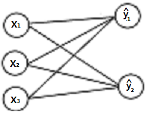

# 내적의 활용 3 : **유사도**
**similarity**
- 두 벡터의 유사성을 정량적으로 나타낸 값.

내적값이 크면 클수록 서로 비슷한 벡터임을 알 수 있다.

X₁, X₂이 서로 유사하고, X₃,x₄가 서로 유사하다고 했을때, X₁.T @ X₂의 값이 X₁.T @ X₃이나 x₄보다 크다.

<br>
<br>

# 내적의 활용 4 :  **선형회귀 모형**

**·** 독립 변수(서로 관계가 없는 변수)x 에 의해서 값이 변하는 y를 예측하는 방법

```py
^y(와이 햇) #y를 예측하기 위한 모델
```

가중치 : ^y를 결정하기 위한 x의 중요도를 측정한 값.

y : 실제 변수


```
w=[0,1,2,3]
x=[0,1,2,3]
w@x = ^y
```


> □을 뉴런, →를 곱하기, ^y에 → → →가 모여있으므로 더하기

<br>
<br>

# 행렬과 행렬의 곱셈

두 행렬의 곱셈은 내적과 동일한 규칙을 가진다.

### 1. 곱하는 앞 행렬의 열의 개수와, 뒷 행렬의 행의 개수가 일치.
## 2. (M X N) @ (N X K)의 곱의 결과는 M X K 행렬이 만들어지며, 각 원소의 값은 `각 행벡터와 열벡터를 차례대로 내적한 스칼라 값`이다.


```
M₁.T @ K₁   M₁.T @ K₂,  M₁.T @ K₃
M₂.T @ K₁   M₂.T @ K₂,  M₂.T @ K₃
```
## 선형회귀로 보는 행렬의 곱셈


```perl

                [x₁
[w₁₁,w₁₂,w₁₃  @  x₂       = [^y₁ 
 w₂₁,w₂₂,w₂₃]    x₃]         ^y₂]

#벡터 w₁@벡터 x₁ = ^y₁
#벡터 w₂@벡터 x₂ = ^y₂
        ▽
# 행렬w @ # 행렬 x = 행렬 ^y
```
<br>
<br>

# **교환법칙과 분배 법칙**

#### **벡터와 스칼라와는 달리,**

### ⭐ **행렬의 `곱셈`은 교홥법칙이 성립하지 않는다.** ⭐

AB ≠ `(항상)`BA
<br><br>
### **행렬의 `덧셈`은 분배법칙이 성립한다.**

A(B+C) = AB + AC

(A+B)C = AC + BC
<br><br>
## **전치연산의 분배법칙**
### **`덧셈`의 전치연산또한 분배법칙이 성립한다.**
(A+B)T=AT+BT
<br><br>
곱셈은 분배되면서 곱셈의 순서가 바뀐다.

1. (A·B)T=BT·AT
2. (A·B·C)T=CT·BT·AT
<br>
<br>

# **곱셈의 연결**

행렬의 곱셈이 연결되어 있을 때, 순서는 **상관이 없다.**

A @ B @ C @D

(AB)CD = A(BC)D = AB(CD)

<br>
<br>

# 항등행렬의 곱셈

항등행렬 = I

1. 어떤 행렬이든 항등행렬을 곱하면 행렬의 값이 변하지 않는다.
2. 항등행렬과의 곱은 교환법칙이 성립한다.

<br>
<br>

# 행렬과 벡터의 곱셈
> "NxM인 행렬과 M차원 벡터끼리는 곱이 가능하다."
## **행렬과 벡터의 곱은 `벡터`**
> M차원 벡터 = M X 1
(N X M) @ (M X 1) = N X 1 

<br>
<br>

## 행렬과 벡터의 내적은 선형조합으로 표현할 수 있다.

```perl
2 x 3 행렬 M과 벡터 V의 내적 

[w₁₁ | w₁₂ | w₁₃    [V₁
 w₂₁ | w₂₂ | w₂₃]    V₂
                     V₃]  

에서 각 w₁₁, w₂₁ 와 같이 같은 열에 놓인 값을 Cn으로 묶어보면 
M = [ c₁    C₂    C₃ ] 로 마치 행벡터로 표현할 수 있고, 

V =  
[ V₁
  V₂ 
  V₃] 으로 각각 스칼라 값이다.

따라서 둘의 내적은 c₁V₁ + C₂V₂ + C₃V₃ 이며, 

 c₁,C₂,C₃는 각각 "열벡터" 이므로 "벡터와 스칼라의 곱의 덧셈" 인 "선형조합" 이다. 

[1 2 3]   [2]          [1X2 + 2X3 + 3X4]   [20]   
[4 5 6] & [3]  의 곱을  [4X2 + 5X3 + 6X4]   [47]로도 표현할 수 있지만
          [4] 

                     [1]     [2]     [3] [20]
        선형조합  2 X    + 3 X   + 4 X   =     로도 표현이 가능하다.
                     [4]     [5]     [6] [47]
```

# 잔차

### 측정치 벡터 X와 선형회귀를 통해 예측한 가중치벡터 w의 내적으로 구한  ^y가 실제값 y의 실제 오차. 

공식:
> # e = y - ^y
> ## = y - 